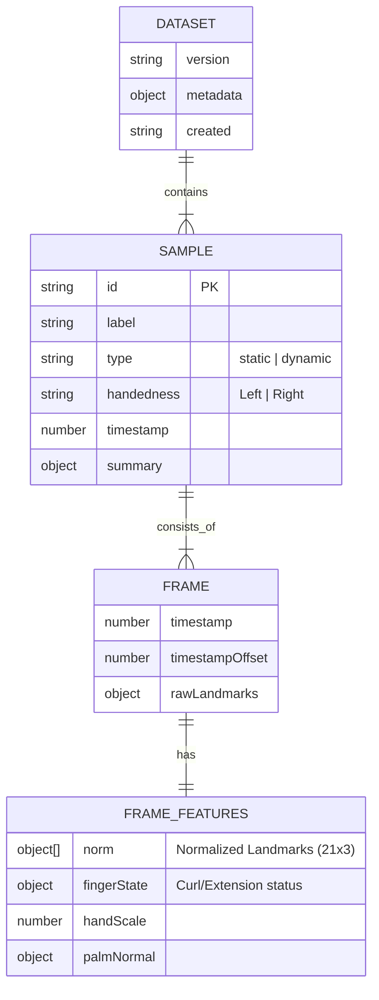

# Entity Relationship Diagram (ERD)
## Context: Data Capture JSON Schema

The application uses a document-based structure for its dataset (JSON). Below is the schema definition representing the relationships between the captured data entities.

### Entity Definitions

#### 1. Dataset
The root object containing the entire collection of recorded sessions.
*   `version`: Schema version (e.g., "1.0.0").
*   `metadata`: Information about the capture session (e.g., device info, user ID).

#### 2. Sample
Represents a single recorded instance of a gesture (e.g., "One recording of the letter 'A'").
*   `id`: Unique UUID.
*   `label`: The ground truth label (e.g., "A", "HELLO").
*   `type`: Classification type (`static` or `dynamic`).
*   `handedness`: The hand used (`Left` or `Right`).

#### 3. Frame
A single snapshot of time within a sample.
*   `rawLandmarks`: Direct output from MediaPipe (x, y, z in screen/world coords).
*   `timestamp`: System high-resolution timestamp.

#### 4. FrameFeatures
Derived data used for ML training.
*   `norm`: Pre-processed landmarks (centered, scaled, rotation-invariant).
*   `fingerState`: Semantic description of fingers (Curled/Extended).
