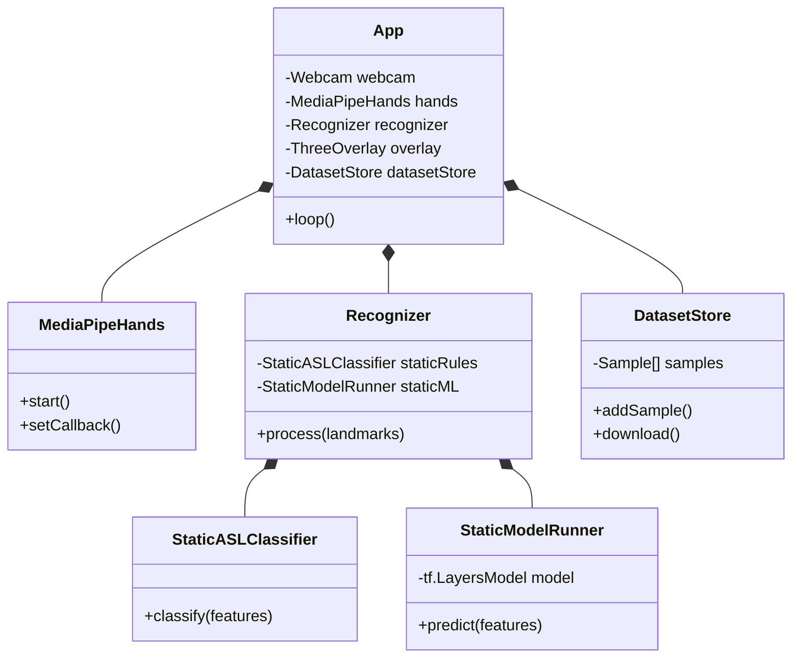

# Entity Relationship Diagram (Data Models)

Since HoloSign AR is primarily a client-side application with local storage for datasets, this ERD represents the Class structure and the JSON Data Schema.

## 1. Class Relationships



## 2. Dataset JSON Schema (`capture_data.json`)

The application stores captured training data in a JSON structure.

```json
{
  "version": "1.0",
  "samples": [
    {
      "id": "UUID_STRING",
      "timestamp": 1678900000000,
      "label": "A",
      "type": "static",
      "handedness": "Right",
      "frames": [
        {
          "timestamp": 123.45,
          "features": {
            "norm": [
              { "x": 0.5, "y": 0.5, "z": 0.0 },
              // ... 21 landmarks
            ],
            "world": [
              // ... 21 landmarks
            ]
          }
        }
      ]
    }
  ]
}
```

## 3. Core Data Structures

### HandResult
*   **landmarks:** Array<Landmark> (x, y, z)
*   **worldLandmarks:** Array<Landmark>
*   **handedness:** 'Left' | 'Right'
*   **score:** number

### RecognitionResult
*   **label:** string
*   **confidence:** number
*   **type:** 'static' | 'dynamic'
*   **debugInfo:** string[]